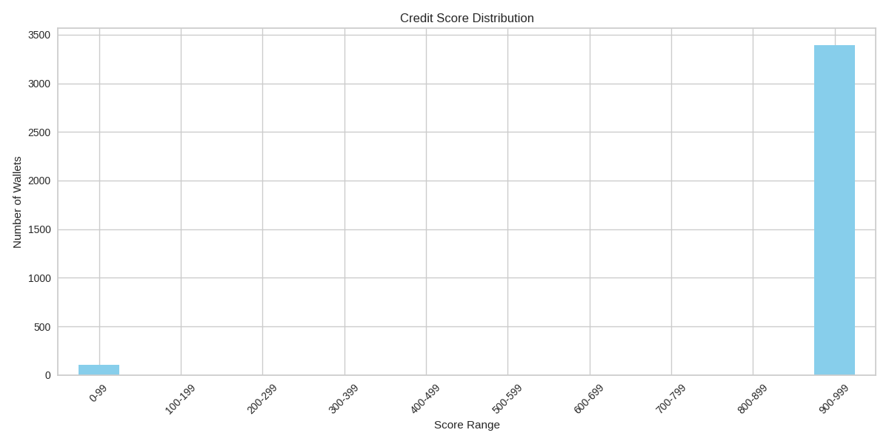
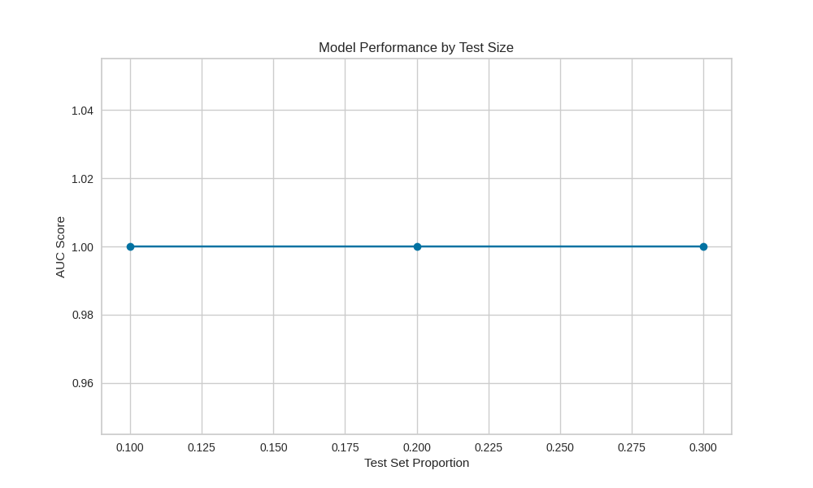

# DeFi Credit Score Analysis Report

## Summary Statistics
|                      |           0 |
|:---------------------|------------:|
| mean_score           | 970.147     |
| median_score         | 999         |
| min_score            |   0         |
| max_score            | 999         |
| top_10_percentile    | 999         |
| bottom_10_percentile | 999         |
| default_rate         |   0.0288819 |

## Score Distribution
| credit_score   |   count |
|:---------------|--------:|
| 0-99           |     101 |
| 100-199        |       0 |
| 200-299        |       0 |
| 300-399        |       0 |
| 400-499        |       0 |
| 500-599        |       0 |
| 600-699        |       0 |
| 700-799        |       0 |
| 800-899        |       0 |
| 900-999        |    3396 |

## Model Performance
|    |   train_size |   test_size |   auc |
|---:|-------------:|------------:|------:|
|  0 |          0.9 |         0.1 |     1 |
|  1 |          0.8 |         0.2 |     1 |
|  2 |          0.7 |         0.3 |     1 |

## Cluster Characteristics
**Cluster 0.0 (Rank 0.0)**
- Size: 3496.0 wallets (100.0%)
- Avg Credit Score: 971
- Avg TX Frequency: 531.0 tx/day
- Avg Deposit/Borrow Ratio: 6923568701264894099456.00
- Avg Repay/Borrow Ratio: 2229250021721692416.00
- Liquidation Rate: 2.9%
- High Frequency Rate: 12.2%
- Risk Score: -445850004344338496.000

**Characteristics:**
- Responsible long-term users
- High deposit/borrow ratios
- Consistent repayments
- No liquidations
- Low transaction frequency

**Cluster 1.0 (Rank 1.0)**
- Size: 1.0 wallets (0.0%)
- Avg Credit Score: 1000
- Avg TX Frequency: 216.5 tx/day
- Avg Deposit/Borrow Ratio: 1.00
- Avg Repay/Borrow Ratio: 1.00
- Liquidation Rate: 0.0%
- High Frequency Rate: 100.0%
- Risk Score: 0.200

**Characteristics:**
- Moderate users
- Balanced activity
- Occasional borrowing
- Rare liquidations

## Risk Analysis
### High-Score Wallets (700-1000)
- Typically in top behavior clusters (Rank 0-1)
- Consistent deposit/repay patterns
- High repay/borrow ratios (>1.5)
- No liquidation history
- Moderate transaction frequency

### Medium-Score Wallets (300-699)
- Mixed behavior patterns
- Moderate deposit/borrow ratios (0.5-1.5)
- Occasional borrowing without full repayment
- Rare liquidation events

### Low-Score Wallets (0-299)
- High-risk behavior patterns
- Frequent liquidations
- Extremely high or low transaction frequency
- Low repay/borrow ratios (<0.5)
- Often show bot-like behavior patterns
